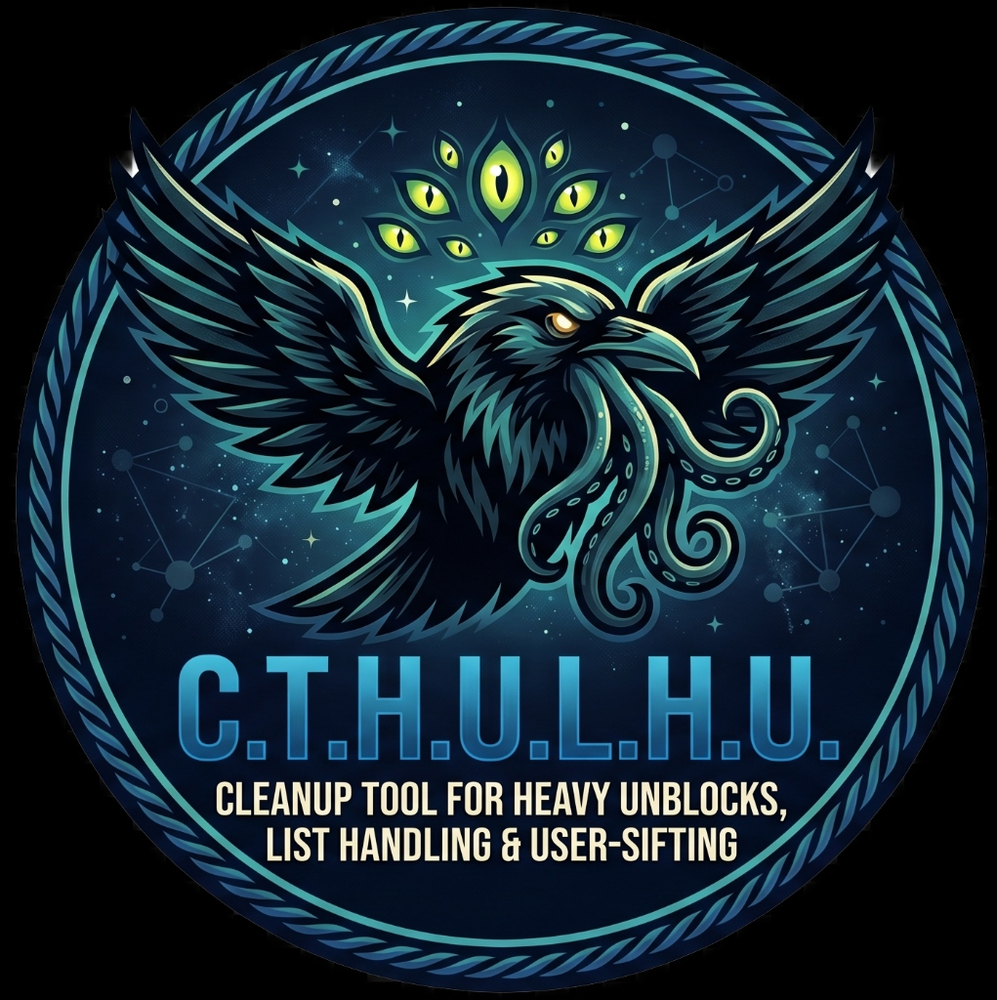
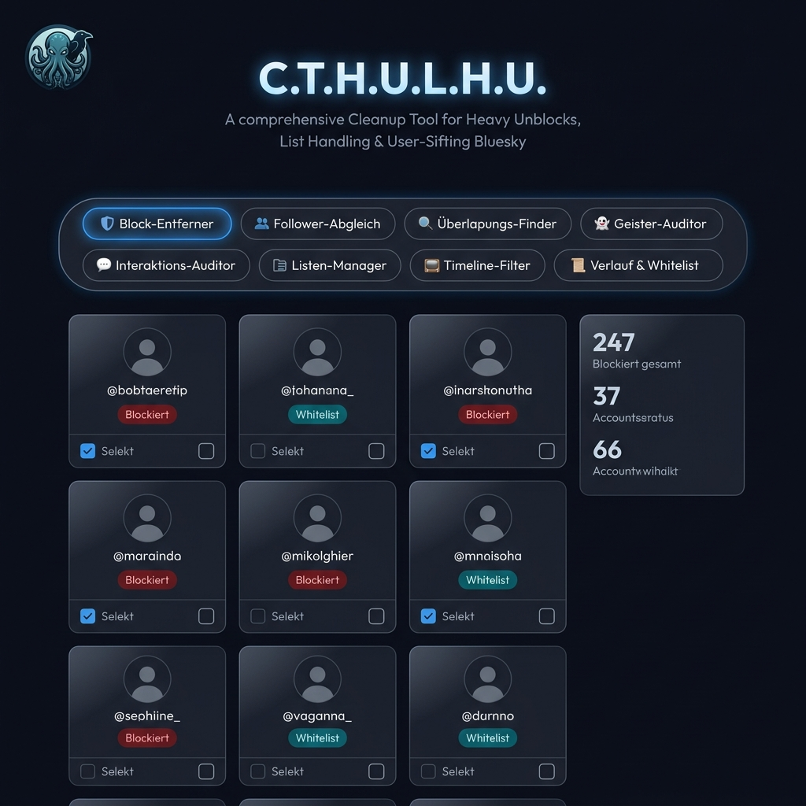
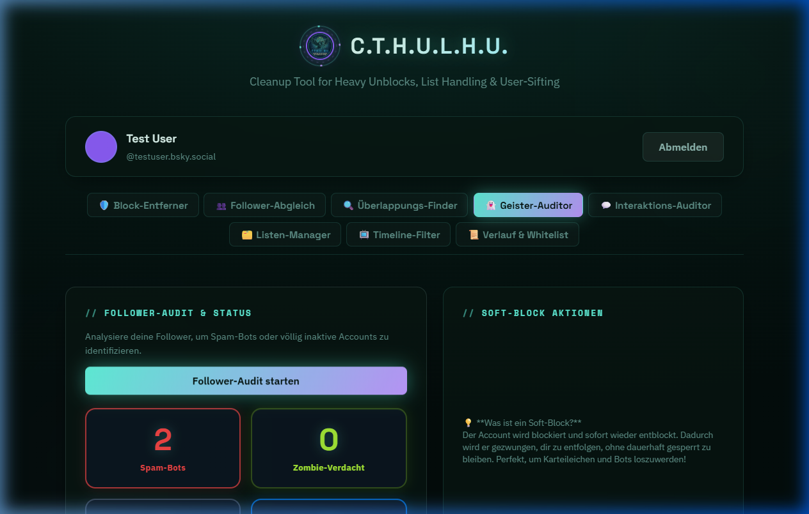
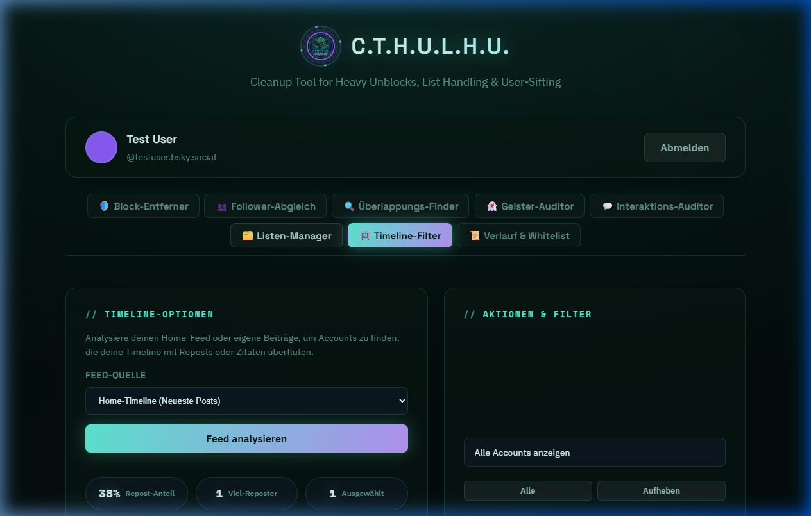
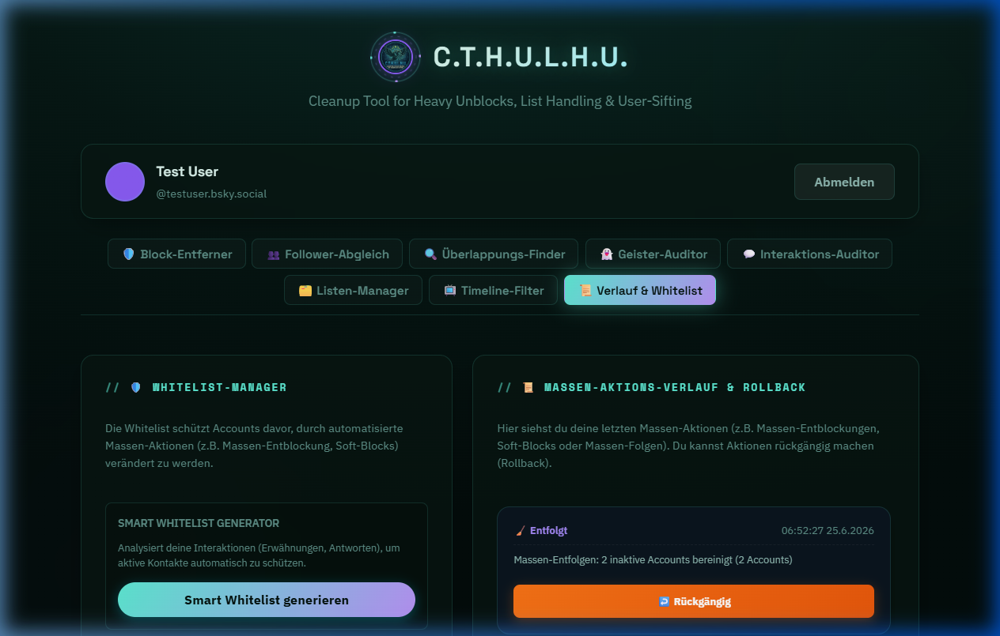
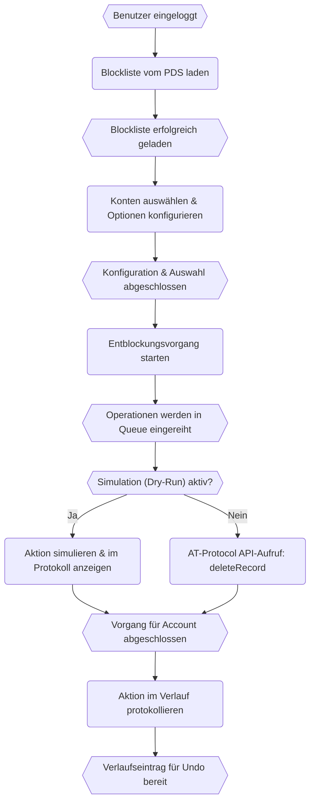
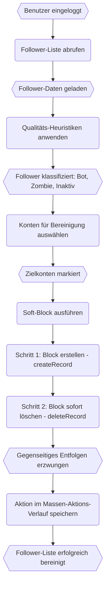
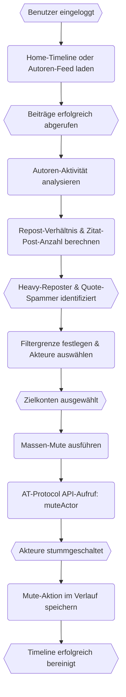
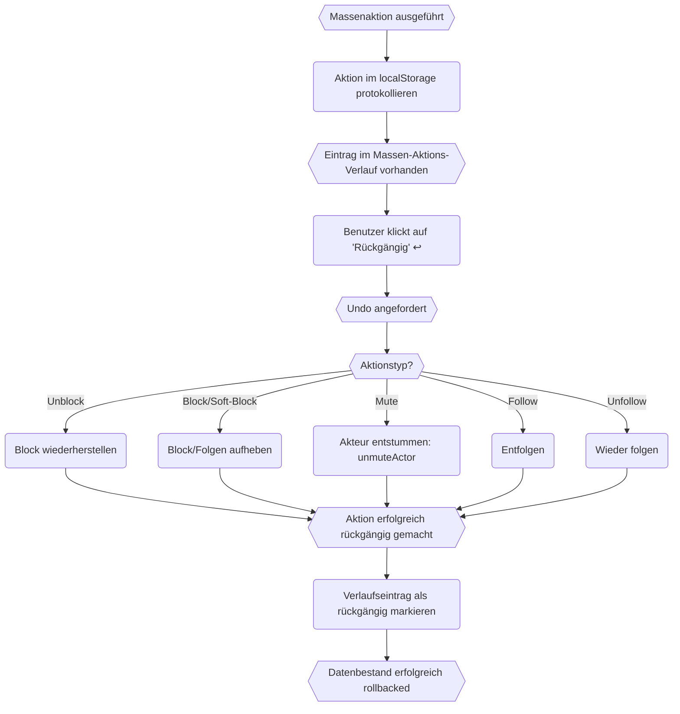

<div align="center">



# C.T.H.U.L.H.U.

### **C**leanup **T**ool for **H**eavy **U**nblocks, **L**ist **H**andling & **U**ser-**S**ifting

*Eine leistungsstarke, browserbasierte Suite zur Verwaltung von Bluesky-Konten*

[](LICENSE)
[](https://github.com/kolkrabeofdoom/C.T.H.U.L.H.U./releases)
[](https://bsky.app)
[](https://nodejs.org)

</div>

---

> **C.T.H.U.L.H.U.** ist ein selbstgehostetes, auf Privatsphäre ausgerichtetes Web-Tool für Power-User, die die volle Kontrolle über ihre Bluesky-Erfahrung übernehmen möchten. Verwalte Blockierungen, Follower, Feeds, Listen und Interaktionen mit chirurgischer Präzision – ganz ohne deine Zugangsdaten an einen Drittanbieter-Cloud-Dienst zu übergeben.

---

## ✨ Die Module im Überblick

| Modul | Beschreibung |
|---|---|
| 🛡️ **Block-Entferner** | Massen-Entblockung von Benutzern mit Erkennung von Phantom-Einträgen, Whitelist-Schutz & Concurrency-Workern |
| 👥 **Follower-Abgleich** | Vergleiche deine Follows/Follower, finde Nicht-Mutuals, führe Massen-Follows oder -Unfollows durch |
| 🔍 **Überlappungs-Finder** | Finde gemeinsame Follower zwischen 2–3 Bluesky-Konten und folge der Schnittmenge im Batch |
| 👻 **Geister-Auditor** | Überprüfe deine Follower-Liste auf Bots, inaktive Konten und Zombie-Profile |
| 💬 **Interaktions-Auditor** | Scanne die Kommentare deiner letzten Beiträge auf Spam-Bots und Krypto-Scammer |
| 🗂️ **Listen-Manager** | Durchsuche, klone und verschmelze deine Bluesky-Kurationslisten |
| 📺 **Timeline-Filter** | Analysiere deine Home-Timeline auf Heavy-Reposter und Zitat-Post-Spammer, um diese stummzuschalten |
| 📜 **Verlauf & Whitelist** | Intelligenter Whitelist-Builder + komplettes Aktions-Undo-Log mit Ein-Klick-Rollback |

---

## 📸 Screenshots

### Hauptoberfläche – Block-Entferner


*Der Block-Entferner-Tab zeigt deine Blockliste als interaktive Karten. Enthält Statistik-Dashboard, Massenauswahl, Whitelist-Schutz und Erkennung von Phantom-Einträgen.*

---

### 👻 Geister-Auditor – Follower-Qualitätsanalyse


*Analysiert jeden Follower nach Spam-Bot-Mustern, totaler Inaktivität und der neuen Zombie-Account-Heuristik. Nutze Soft-Block, um sie sauber aus deiner Follower-Liste zu entfernen.*

---

### 📺 Timeline-Filter – Repost- & Zitat-Post-Analyse


*Lädt deine Home-Timeline, gruppiert Beiträge nach Ersteller und berechnet die Repost-Rate. Heavy-Reposter werden für Massen-Muting vorausgewählt. Filterbar nach "Heavy Reposter ≥50%" oder "Quote-Post Heavy".*

---

### 📜 Verlauf & Whitelist – Intelligente Whitelist + Undo-Protokoll


*Links: Die intelligente Whitelist schlägt automatisch Gesprächspartner aus deinen letzten Beiträgen vor. Rechts: Der Massen-Aktions-Verlauf protokolliert jede Aktion und ermöglicht ein Ein-Klick-Rollback.*

---

## 🧠 Feature-Deep-Dives & EPK-Prozessdiagramme

### 🛡️ Block-Entferner (Bulk Unblock)

Importiere deine Bluesky-Blockliste und verwalte sie effizient:

- **Phantom-Eintrag-Erkennung**: Identifiziert Blockierungen, die in deinem lokalen AT-Protokoll-Repository existieren, aber nicht mehr in der API angezeigt werden (diese "Phantome" blockieren saubere Abläufe).
- **Whitelist-Schutz**: Markiere Accounts als geschützt. Whiteliste DIDs werden niemals in Massen-Entblockungen einbezogen.
- **Concurrency Worker**: 4 parallele Worker mit 100ms Drosselung zur Vermeidung von API-Rate-Limits.
- **Pause & Fortsetzen**: Vorgänge können jederzeit pausiert und fortgesetzt werden.
- **Dry-Run-Modus**: Simuliert Aktionen, ohne Daten auf dem PDS zu ändern.

#### EPK-Prozessdiagramm (Ereignisgesteuerte Prozesskette)



---

### 👥 Follower-Abgleich (Follower Comparison)

Vergleiche, wem du folgst, mit denen, die dir folgen:

- Lädt bis zu 3.000+ Follows/Follower über paginierte APIs.
- Visuelle Badges: **Mutual** (Gegenseitig), **Folge ich**, **Folgt mir**, **Keine**.
- Filter-Tabs: Alle, Nicht-Mutuals, Nicht-Follower, Mutuals.
- Massen-Follow/Unfollow über die Concurrency-Queue.
- Enthält den **Follower-Kopierer**: Kopiere die Follower eines beliebigen anderen Accounts auf dein eigenes Profil.

---

### 🔍 Nischen- & Überlappungs-Finder (Niche Overlap Finder)

Entdecke gemeinsame Communities zwischen verschiedenen Accounts:

- Gib 2 oder 3 Bluesky-Handles ein, um sie zu vergleichen.
- Lädt bis zu 1.500 Follower pro Ziel-Account.
- Berechnet die mathematische **Schnittmenge** der Follower-DIDs.
- Zeigt die Beziehungs-Badges zu dir (mutual, folge ich, blockiert) an.
- Nutze Massen-Folgen für die Schnittmenge, um dein Netzwerk gezielt zu erweitern.

---

### 👻 Geister-Auditor (Ghost & Bot Auditor)

Dreistufige Analyse der Follower-Qualität:

| Badge | Kriterien |
|---|---|
| ⚠️ **Bot?** | 0 Beiträge + kein Profilbild/Bio, ODER Folgt-Anzahl > 500 mit einem Verhältnis von > 5× zu eigenen Followern |
| 🧟 **Zombie?** | Hat Beiträge, aber Folgt-Anzahl > 500, Follower < 30, Verhältnis > 8× — ehemals inaktiv, nun Massen-Folgen |
| 💤 **Inaktiv** | 0 Beiträge insgesamt |

**Soft-Block**: Entfernt Geister-Accounts sauber aus deiner Follower-Liste. Es wird ein Block-Eintrag erstellt und sofort wieder gelöscht. Dies zwingt das Bluesky-System zu einem gegenseitigen Entfolgen, ohne dass eine permanente Blockierung bestehen bleibt.

#### EPK-Prozessdiagramm (Ereignisgesteuerte Prozesskette)



---

### 💬 Interaktions-Auditor (Spam Comment Scanner)

Schütze deine Beiträge vor Spam und Krypto-Scams:

- Lädt deine 15 neuesten Beiträge.
- Holt alle Antwort-Threads für jeden dieser Beiträge.
- **Spam-Heuristiken**: Regex-basierte Erkennung von Krypto- und Link-Spam-Mustern (`telegram`, `whatsapp`, `earn`, `crypto`, `dm me`, etc.).
- Markiert Spam-Verdächtige für Massen-Blockierungen oder manuelle Prüfung.

---

### 🗂️ Listen-Manager (List Manager)

Volle Kontrolle über deine Kurationslisten:

- Durchsuche all deine Moderations- und Kurationslisten.
- Betrachte die Listenmitglieder im gleichen Grid-Design.
- **Liste klonen**: Dupliziere eine Liste unter neuem Namen.
- **Listen verschmelzen**: Kombiniere zwei Listen zu einer einzigen, inklusive automatischer Deduplizierung.

---

### 📺 Timeline-Filter (Feed Sifter)

Kuratiere deinen Feed direkt an der Quelle:

- Lädt deine **Home-Timeline** oder deinen eigenen **Autoren-Feed**.
- Gruppiert Beiträge nach Ersteller und berechnet:
  - `repostCount / postsCount` → Repost-Prozentwert
  - `quoteCount` → Kennzeichnung für Zitat-Post-Spammer
- Wählt Accounts mit einer Repost-Rate von ≥ 50% für Massen-Muting aus.
- Massen-**Mute**: Schaltet Ersteller stumm (blendet Beiträge aus, ohne zu entfolgen).
- Alle Stummschaltungen werden im Verlauf für ein späteres Undo protokolliert.

#### EPK-Prozessdiagramm (Ereignisgesteuerte Prozesskette)



---

### 📜 Verlauf & Whitelist (History & Smart Whitelist)

Verliere nie die Übersicht über deine Massenaktionen:

**Intelligente Whitelist:**
- Scanne deine letzten Beiträge nach Gesprächspartnern (Replies) und füge sie automatisch zur Whitelist hinzu.
- Manuelle Eingabe: Füge beliebige Handles oder DIDs direkt zur Liste hinzu.
- Speicherung im `localStorage` — überdauert das Schließen des Browsers.
- Geschützte Accounts werden in allen anderen Tabs farblich hervorgehoben.

**Massen-Aktions-Verlauf (Undo-System):**
- Jede durchgeführte Massenaktion (Folgen, Entfolgen, Blockieren, Entblocken, Soft-Block, Mute) wird protokolliert.
- Speichert bis zu **50 Einträge** im `localStorage`.
- Ein-Klick-**↩️ Rückgängig** (Rollback) kehrt die Aktion passend um:
  - `unfollow` → folgt erneut via `createRecord`
  - `follow` → entfolgt via `deleteRecord`
  - `block` → löscht den Block-Eintrag
  - `unblock` → erstellt den Block-Eintrag erneut
  - `mute` → ruft `unmuteActor` für alle Ziele auf
  - `softblock` → warnt und ermöglicht optionales Wiederfolgen

#### EPK-Prozessdiagramm (Ereignisgesteuerte Prozesskette)



---

## 🚀 Erste Schritte

### Voraussetzungen

- [Node.js](https://nodejs.org/) v18 oder höher
- Ein [Bluesky](https://bsky.app)-Konto
- Ein **App-Passwort** (Einstellungen → Privatsphäre & Sicherheit → App-Passwörter)

> ⚠️ **Verwende niemals dein Haupt-Passwort.** Erstelle immer ein eigenes App-Passwort für Drittanbieter-Tools.

### Installation

```bash
git clone https://github.com/kolkrabeofdoom/C.T.H.U.L.H.U..git
cd C.T.H.U.L.H.U.
npm install
```

### Server starten

```bash
node server.js
```

Oder unter Windows: Doppelklick auf die Datei `run.bat`.

Öffne anschließend deinen Browser unter: **http://localhost:3000**

### Demo- & Testmodus

Um die UI ohne Bluesky-Login direkt mit Demo-Daten auszuprobieren, rufe folgende URL auf:

```
http://localhost:3000/?test=1
```

Dies lädt für alle 8 Module vorausgefüllte Testdatensätze.

---

## 🔐 Privatsphäre & Sicherheit

- **100% lokal** — Es werden keine Daten an Drittserver gesendet. Alle Anfragen gehen direkt vom Browser an das Bluesky-API (`bsky.social` oder deine eigene PDS-Instanz).
- **Keine Tracker, Analytics oder Telemetrie.**
- Deine Anmeldedaten werden ausschließlich im `sessionStorage` deines Browsers abgelegt und beim Schließen des Tabs gelöscht.
- Whitelist und Aktionsverlauf werden unter deiner DID im `localStorage` gespeichert.

---

## 🛠️ Technische Architektur

```
C.T.H.U.L.H.U./
├── index.html          # Single-Page-App mit allen Tab-Panels
├── app.js              # ~6.000 Zeilen: State-Verwaltung, API-Logik und UI-Rendering
├── style.css           # ~2.100 Zeilen: Glassmorphism Design-System
├── server.js           # Minimaler Node.js Server zur Bereitstellung der statischen Dateien
├── run.bat             # Windows-Starter per Doppelklick
└── screenshots/        # Bilder für die README.md
```

---

## 🤝 Mitwirken

Beiträge, Fehlerberichte und Feature-Ideen sind herzlich willkommen! Bitte erstelle ein [Issue](https://github.com/kolkrabeofdoom/C.T.H.U.L.H.U./issues) oder reiche einen Pull Request ein.

---

## 📜 Lizenz

[MIT](LICENSE) — Freie Nutzung, Modifikation und Weitergabe.

---

## 🐦 Mit 🖤 entwickelt für die Bluesky-Community

*Von [Kolkrabe of Doom](https://bsky.app/profile/kolkrabe.bsky.social) — "Just your average postanarchist nerd raven"*
